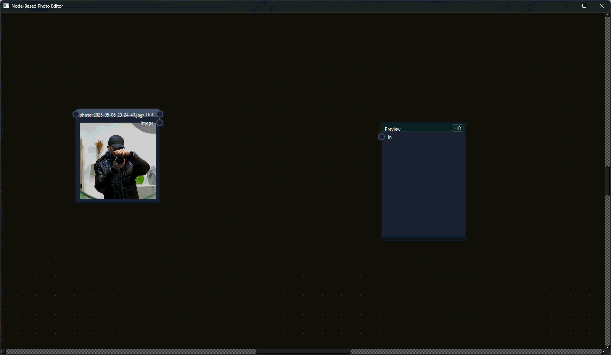

# Node-Based Photo Editor

An experimental node-based photo editor and image processing environment built with Python and PyQt6.



> A personal experiment in building an extensible, graph-based image editing workflow from scratch.

---

## About The Project

This project started from a personal interest in photography and a simple problem.

At the time, I was using **Arch Linux with i3 Window Manager** as my primary environment and was looking for a photo editing workflow that suited my needs. While the limited availability of suitable tools on Linux was one of the main motivations, the project quickly became something more than an attempt to replace an existing editor.

I became interested in a different approach to image editing:

> What if image processing could be built as a visual graph of independent nodes instead of a traditional collection of editing tools?

That idea became the foundation of this project.

The result is an experimental **node-based image processing environment** where images flow through connected nodes. Each node can perform a specific operation and pass its result to other nodes in the graph.

---

## Features

- 🧩 Node-based image processing workflow
- ♾️ Large canvas with pan and zoom
- 🔗 Visual connections between nodes
- 🔌 Extensible node system
- 📂 Dynamic loading of nodes from the `nodes/` directory
- 🖼️ Image loading and processing pipeline
- 👁️ Image preview nodes
- 🔎 Search-based node creation
- ⚡ Background processing using Qt's threading system
- 💾 Node output caching
- 🎨 Image processing with Pillow and OpenCV
- 🧱 Built around an extensible graph architecture

---

# Screenshots

## The Node Workspace

The application is built around a visual workspace where nodes can be created, moved, connected, and combined into image processing pipelines.

https://github.com/alirezavaezinia/node-based-photo-editor/blob/main/assets/Screenshots/sc2.png

---

## Example Workflow

An image can move through multiple processing stages:

```text
Image
  │
  ▼
Color Adjustment
  │
  ├──────────────► Preview
  │
  ▼
Grayscale
  │
  ▼
Preview
```

Each node can receive data from another node, process it, and pass the result further through the graph.

https://github.com/alirezavaezinia/node-based-photo-editor/blob/main/assets/Screenshots/sc1.png

---

# Architecture

The project is currently built around two main parts:

```text
src/
│
├── photo_editor.py
├── image_core.py
│
└── nodes/
```

---

## `photo_editor.py`

This file primarily handles the application's visual and interaction layer.

Responsibilities include:

- Main application window
- Infinite canvas
- Graphics scene
- Node interaction
- Node creation
- Node search
- Image loading
- Preview functionality
- Pan and zoom
- Visual node connections

---

## `image_core.py`

This file contains most of the core logic behind the node system.

It includes concepts such as:

- `BaseNode`
- `Socket`
- `Edge`
- Node registry
- Dynamic node loading
- Processing logic
- Cache handling
- Background workers

The project is built around the idea of a reusable base node architecture.

Conceptually:

```text
Input
  │
  ▼
┌─────────────┐
│    NODE     │
│             │
│  PROCESSING │
│             │
└─────────────┘
  │
  ▼
Output
```

---

# Node System

The `nodes/` directory is one of the central ideas behind the project.

Each node can be implemented as an independent Python module.

When the application starts, available node modules can be loaded dynamically and registered in the application.

This makes it possible to extend the editor by adding new processing nodes without placing every feature directly inside the main application code.

Conceptually:

```text
nodes/
│
├── grayscale.py
├── color.py
├── blur.py
├── crop.py
└── custom_node.py
```

A new node can provide its own:

- Inputs
- Outputs
- Parameters
- Image processing logic

This was one of the main architectural goals of the project: creating an image editor that could grow by adding new processing nodes.

---

# Image Processing Graph

The editor treats connected nodes as a processing graph.

For example:

```text
Image
  │
  ▼
Brightness
  │
  ▼
Contrast
  │
  ▼
Grayscale
  │
  ▼
Preview
```

The output of one node can become the input of another node.

This makes it possible to build image processing workflows visually.

---

# Background Processing

Image processing operations can be executed using Qt's threading infrastructure.

The project uses components such as:

- `QRunnable`
- `QThreadPool`

This allows processing operations to run outside the main UI flow and helps keep the interface responsive while nodes are being processed.

---

# Caching

The node system includes a caching mechanism for processed results.

A node can generate a cache key based on information such as:

- Node type
- Input state
- Node parameters

Previously processed results can then be reused instead of recalculating the same operation.

The project includes support for:

- In-memory caching
- Disk-based caching

---

# Technology Stack

## Language

- Python 3.11

## GUI

- PyQt6

The project originally started with PyQt5, but early in development I moved the GUI implementation to PyQt6.

## Image Processing

- Pillow
- OpenCV

## Other Components

- NumPy
- Python `importlib`
- Qt Graphics View Framework
- Qt Thread Pool

---

# Project Structure

```text
node-based-photo-editor/
│
├── src/
│   │
│   ├── photo_editor.py
│   ├── image_core.py
│   │
│   └── nodes/
│       ├── ...
│       └── ...
│
├── assets/
│   │
│   ├── demo/
│   │   └── demo.gif
│   │
│   └── screenshots/
│       ├── main-interface.png
│       └── node-graph.png
│
├── docs/
│
├── tests/
│
├── README.md
├── requirements.txt
├── .gitignore
└── LICENSE
```

The repository is structured to leave room for future development, documentation, tests, and additional project components.

---

# Installation

Clone the repository:

```bash
https://github.com/alirezavaezinia/node-based-photo-editor.git
```

Move into the project directory:

```bash
cd node-based-photo-editor
```

Create a virtual environment.

### Linux

```bash
python3 -m venv .venv
source .venv/bin/activate
```

### Windows PowerShell

```powershell
python -m venv .venv
.venv\Scripts\Activate.ps1
```

Install the required dependencies:

```bash
pip install -r requirements.txt
```

Run the application:

```bash
python src/photo_editor.py
```

---

# Project Status

⚠️ **Experimental / Prototype**

This project was originally developed as a personal experiment over a relatively short period of time.

It represents an early exploration of:

- Node-based software architecture
- Image processing
- PyQt application development
- Graph-based workflows

Some architectural decisions reflect my level of experience at the time of development.

For example, while the project separates the main application and core logic into `photo_editor.py` and `image_core.py`, the boundaries between UI logic, graph logic, processing logic, and node behavior are not always as clean as they could be.

Some parts of the project would benefit from further modularization and separation of responsibilities.

Rather than hiding those limitations, this repository is published as a record of the experiment and the ideas explored during its development.

---

# Development Story

The project began as a personal experiment.

I was interested in photography and regularly worked with images while using Linux as my primary operating system.

The initial motivation was the difficulty of finding an image editing workflow that matched what I wanted. Instead of continuing to search for the right tool, I decided to experiment with building one myself.

The project was developed primarily using:

- Arch Linux
- i3 Window Manager
- VS Code
- Python 3.11

The original idea was not simply to create another traditional image editor.

The main idea was to experiment with an extensible environment where image operations could exist as independent nodes and be connected visually.

---

# What I Learned

This project became an experiment in several areas:

- Building desktop applications with PyQt
- Working with PyQt5 and PyQt6
- Designing node-based interfaces
- Building graph-based processing systems
- Working with the Qt Graphics View Framework
- Image processing with Pillow
- Using OpenCV
- Dynamic Python module loading
- Background processing
- Cache systems
- Designing extensible software architecture

One of the biggest lessons from this project was understanding the difference between building an architecture for a small prototype and designing one that can scale as a project grows.

Looking back at the project now, I can see several architectural decisions that I would approach differently today.

That is also one of the reasons I decided to publish it.

---

# Future Ideas

Possible directions for future development include:

- Better separation between UI and processing logic
- A cleaner node API
- Improved plugin architecture
- Save and load node graphs
- Graph serialization
- Undo / redo
- More image processing nodes
- Improved error handling
- Better cache management
- Additional image formats
- GPU-based processing experiments
- Automated tests
- Improved documentation

---

# Development Notes

This project was developed as a personal experiment with extensive assistance from AI tools during implementation.

The original project idea, requirements, workflow, and overall direction were defined by the author.

AI tools were used as development assistants during the implementation and experimentation process.

This repository is published both as an experimental software project and as a record of that development process.

---

# License

This project is released under the MIT License.

See the [LICENSE](LICENSE) file for more information.
